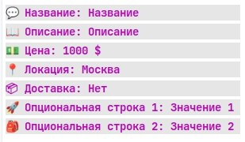
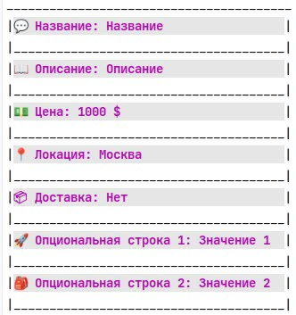
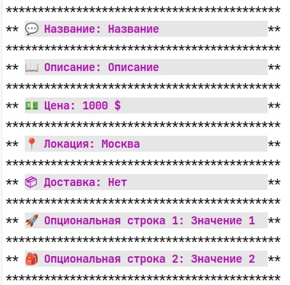

# Функция для отрисовки ячейки товара

## Примеры

### Вариант 1 _(Borderless)_
```
💬 Название: Название                
📖 Описание: Описание                
💵 Цена: 1000 $                      
📍 Локация: Москва                   
📦 Доставка: Нет                     
🚀 Опциональная строка 1: Значение 1 
🎒 Опциональная строка 2: Значение 2 
```

### Вариант 2 _(Border)_
```
________________________________________
|💬 Название: Название                 |
|______________________________________|
|📖 Описание: Описание                 |
|______________________________________|
|💵 Цена: 1000 $                       |
|______________________________________|
|📍 Локация: Москва                    |
|______________________________________|
|📦 Доставка: Нет                      |
|______________________________________|
|🚀 Опциональная строка 1: Значение 1  |
|______________________________________|
|🎒 Опциональная строка 2: Значение 2  |
|______________________________________|
```

### Вариант 3 _(StarredBorder)_
```
*******************************************
** 💬 Название: Название                 **
*******************************************
** 📖 Описание: Описание                 **
*******************************************
** 💵 Цена: 1000 $                       **
*******************************************
** 📍 Локация: Москва                    **
*******************************************
** 📦 Доставка: Нет                      **
*******************************************
** 🚀 Опциональная строка 1: Значение 1  **
*******************************************
** 🎒 Опциональная строка 2: Значение 2  **
*******************************************
```


## Использование

### Создание

Тип ячейки имеет следущий вид:

```go
type Cell []Row
type Row  = [3]string
```

Для начала необходимо **создать ячейку**:

```go
c := cell.New(
cell.Row{"💬", "Название", "Станок"},
cell.Row{"📖", "Описание", "Станок для дерева"},
cell.Row{"💵", "Цена", "1000 $"},
cell.Row{"📍", "Локация", "Москва"},
cell.Row{"📦", "Доставка", "Нет"},
cell.Row{"🚀", "Опциональная строка 1", "Значение 1"},
cell.Row{"🎒", "Опциональная строка 2", "Значение 2"},
)
```
Учтите, что ячейка **должна содержать обязательные строки**,
чтобы узнать, какие строки обязательны, воспользуйтесь следующей функцией:
```go
func GetRequiredRowNames() []string
```
В случае, если обязательные строки не были переданы, функция вернет пустой указатель **nil**.

Сигнатура функции **New** имеет следующий вид:

```go
func New(rows ...Row) *Cell
```


### Отрисовка

Для отрисовки ячейки необходимо вызвать фунцию **Draw** у типа **Cell**:

```go
c.Draw(c.Borderless())
```

Где функция отрисовки имеет следующую сигнатуру:

```go
func (c *Cell) Draw(drawingFunc DrawingFunc, mods ...Mod)
```

Поддерживаемые **типы отрисовки**:

```go
type DrawingFunc func (mods ...Mod)

func (c *Cell) Borderless() DrawingFunc
func (c *Cell) Border() DrawingFunc
func (c *Cell) StarredBorder() DrawingFunc
```

Тип **Mod** представляет собой функцию по модификации строки:
```go
type Mod func(s string) string
```

Поддерживаемые **модификации**:

**Цветовы**
 ```go
func ColorFunc(col Color) Mod
```
Где **Color** имеет вид:
```go
type Color int

const (
	Black = Color(iota)
	Red
	Green
	Brown
	Blue
	Purple
	Cyan
	LightGray
)
```

**Color** имеет два представления: _Foreground_ и _Background_

```go
func (c Color) Foreground() Color 
func (c Color) Background() Color 
```

При использовании _Foreground_ и _Background_ цвет будет применяться к самим символам
строки и к их _заднему фону_ соответственно.

**Символьные**

```go
func CharFunc(typ CharType) Mod 
```
Где **CharType** имеет вид:
```go
type CharType int

const (
	Normal     = CharType(0)
	Bold       = CharType(1)
	Underlined = CharType(4)
	Blinking   = CharType(5)
	Reverse    = CharType(7)
)
```

_Пользователь может определять свои **Mod'ы** и передавать их в функцию отрисовки_

## Примеры использования

```go

c := cell.CreateCell("Название",
"Описание",
"1000 $",
"Москва",
"Нет",
cell.Row{"🚀", "Опциональная строка 1", "Значение 1"},
cell.Row{"🎒", "Опциональная строка 2", "Значение 2"},
)

c.Draw(c.Borderless(),
	cell.ColorFunc(cell.LightGray.Background()),
	cell.ColorFunc(cell.Purple.Foreground()),
	cell.CharFunc(cell.Bold), 
	)

c.Draw(c.Border(),
	cell.ColorFunc(cell.LightGray.Background()),
	cell.ColorFunc(cell.Purple.Foreground()),
	cell.CharFunc(cell.Bold),
    )

c.Draw(c.StarredBorder(),
	cell.ColorFunc(cell.LightGray.Background()),
	cell.ColorFunc(cell.Purple.Foreground()),
	cell.CharFunc(cell.Bold),
	)
```

**Результат работы**:


<p>
 
 
 
</p>


